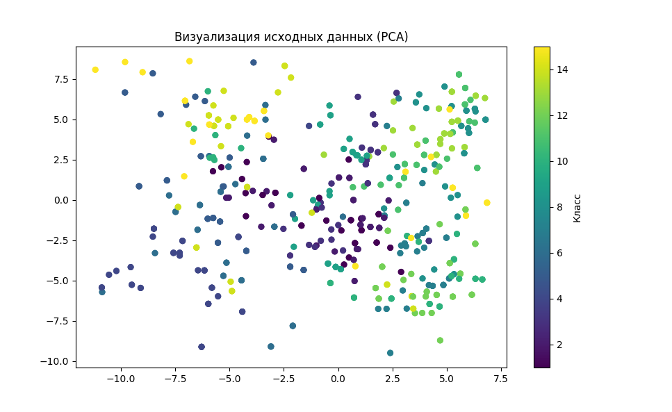
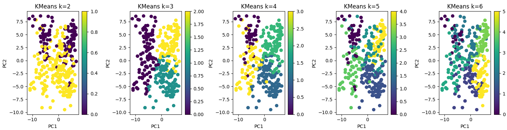
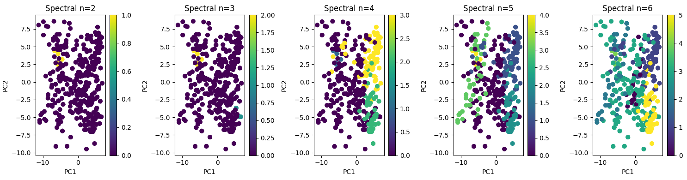
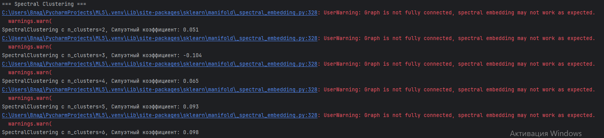
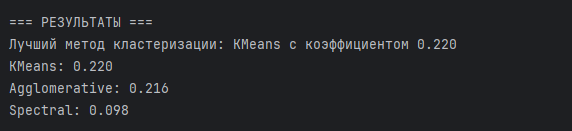
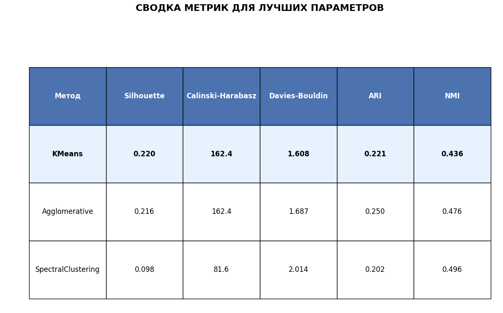

# Лабораторная работа 5. Алгоритмы кластеризации данных
## Задание
Перед выполнением лабораторной работы необходимо загрузить набор данных в соответствии с вариантом на диск.

1. Произвести масштабирование признаков (scaling).
2. С использованием библиотеки scikit-learn написать программу с использованием алгоритмов кластеризации данных, позволяющую разделить исходную выборку на классы, соответствующие предложенной вариантом задаче (http://scikit-learn.org/stable/modules/clustering.html).
3. Провести эксперименты и определить наилучший алгоритм кластеризации, параметры алгоритма. Необходимо использовать не менее 3-х алгоритмов. Данные экспериментов необходимо представить в отчете (графики, ход проведения эксперимента, выводы).
## Вариант 6
Libras Movement - Распознавание жестов бразильского языка жестов

## Загрузка dataset и его подготовка
```
# Функция для загрузки данных из папки dataset
def load_dataset_from_folder(folder_path):
    """
    Загружает все .data файлы из указанной папки и объединяет их в один датасет
    """
    all_data = []

    # Проходим по всем файлам в папке
    for filename in os.listdir(folder_path):
        if filename.endswith('.data'):
            file_path = os.path.join(folder_path, filename)
            try:
                # Читаем файл, предполагая, что данные разделены запятыми
                data = pd.read_csv(file_path, header=None)
                all_data.append(data)
                print(f"Загружен файл: {filename} с {len(data)} примерами")
            except Exception as e:
                print(f"Ошибка при загрузке {filename}: {e}")

    if not all_data:
        raise ValueError("Не найдено .data файлов в указанной папке")

    # Объединяем все данные
    combined_data = pd.concat(all_data, ignore_index=True)
    print(f"Всего загружено примеров: {len(combined_data)}")

    return combined_data

# Загрузка данных из папки dataset
dataset_folder = 'dataset'  # Путь к папке с данными
data = load_dataset_from_folder(dataset_folder)

# Предполагаем, что последний столбец - это метка класса
X = data.iloc[:, :-1]  # Все столбцы кроме последнего
y = data.iloc[:, -1]  # Последний столбец - метка

print(f"Размерность данных: {X.shape}")
print(f"Уникальные классы: {np.unique(y)}")

# Масштабируем признаки
scaler = StandardScaler()
X_scaled = scaler.fit_transform(X)

# Преобразуем в плотный массив для совместимости
X_scaled_dense = X_scaled

# Визуализация данных после PCA
pca = PCA(n_components=2)
X_pca = pca.fit_transform(X_scaled_dense)

plt.figure(figsize=(10, 6))
plt.scatter(X_pca[:, 0], X_pca[:, 1], c=y, cmap='viridis', s=30)
plt.title("Визуализация исходных данных (PCA)")
plt.colorbar(label='Класс')
plt.show()
```
## Центроид

Центроид - центр кластера, рассчитываемый как среднее арифмитическое всех точек в данном кластере.

## Кластер

Кластер - это способ группировки инфорации, при котором объекты разделяются на группы по схожести и близости.

В коде используются три метода кластеризации:

KMeans (K-средних)

AgglomerativeClustering (Агломеративная кластеризация)

SpectralClustering (Спектральная кластеризация)

## KMeans (Метод K-средних)
Как работает:
Инициализация: Случайно выбираются K точек в качестве начальных центроидов кластеров

Назначение: Каждая точка данных назначается ближайшему центроиду (по евклидову расстоянию)

Обновление: Центроиды пересчитываются как среднее значение всех точек в кластере

Повторение: Шаги 2-3 повторяются до сходимости (когда центроиды перестают значительно меняться)

### Цель алгоритма:

Минимизировать внутрикластерную дисперсию (сумму квадратов расстояний от точек до центроидов).

Найти компактные, сферические кластеры примерно одинакового размера.

## Agglomerative Clustering (Агломеративная кластеризация)

Как работает:
Начало: Каждая точка считается отдельным кластером

Поиск: Находится пара наиболее близких кластеров

Объединение: Два ближайших кластера объединяются в один

Повторение: Шаги 2-3 повторяются пока не останется один кластер

Дендрограмма: Процесс можно визуализировать в виде дерева

### Цель алгоритма:

Построить иерархическую структуру кластеров

Минимизировать расстояние между объединяемыми кластерами

## Spectral Clustering (Спектральная кластеризация)

Как работает:
Матрица сходства: Строится матрица смежности/сходства между точками

Лапласиан: Вычисляется нормализованный лапласиан графа

Собственные векторы: Находятся первые k собственных векторов

Проекция: Данные проецируются в пространство собственных векторов

Кластеризация: В новом пространстве применяется KMeans

### Цель алгоритма:

Использовать спектральные свойства графа для выявления сложных структур

Преобразовать данные в пространство, где кластеры становятся более разделимыми
## Визуализация данных
```
# Преобразуем разреженную матрицу в плотную перед визуализацией
X_scaled_dense = X_scaled.toarray()

# Визуализация данных после PCA
pca = PCA(n_components=2)
X_pca = pca.fit_transform(X_scaled_dense)

plt.scatter(X_pca[:, 0], X_pca[:, 1], s=30)
plt.title("Визуализация признаков (PCA)")
plt.show()
```

## Функция для оценки кластеризации
```
def evaluate_clustering(model, data):
    labels = model.fit_predict(data)
    # Проверка, что есть более 1 кластера
    if len(set(labels)) > 1 and -1 in labels:
        core_labels = labels[labels != -1]
        core_data = data[labels != -1]
        score = silhouette_score(core_data, core_labels)
    elif len(set(labels)) > 1:
        score = silhouette_score(data, labels)
    else:
        score = -1
    return labels, score
```
core_data — массив данных, для которых считается метрика.
core_labels — метки кластеров для этих данных, то есть, к каким кластерам принадлежат точки.

## Метод кластеризации - KMeans

```
# 1. KMeans
print("\n=== KMeans кластеризация ===")
kmeans_params = [2, 3, 4, 5, 6]
best_score_kmeans = -1
best_kmeans = None
best_labels_kmeans = None
best_k = None
labels_for_k = []  # список для хранения меток для каждого k

for k in kmeans_params:
    kmeans = KMeans(n_clusters=k, random_state=42)
    labels, score = evaluate_clustering(kmeans, X_scaled_dense)
    print(f'KMeans с k={k}, Силуэтный коэффициент: {score:.3f}')
    labels_for_k.append(labels)  # сохраняем метки для каждого k
    if score > best_score_kmeans:
        best_score_kmeans = score
        best_kmeans = kmeans
        best_labels_kmeans = labels  # метки для лучшего k
        best_k = k

print(f'Лучшее число кластеров для KMeans: {best_k} с коэффициентом: {best_score_kmeans:.3f}')

# Визуализация для каждого k
fig, axes = plt.subplots(1, len(kmeans_params), figsize=(15, 4))
for i, k in enumerate(kmeans_params):
    labels = labels_for_k[i]
    scatter = axes[i].scatter(X_pca[:, 0], X_pca[:, 1], c=labels, cmap='viridis')
    axes[i].set_title(f'KMeans k={k}')
    axes[i].set_xlabel('PC1')
    axes[i].set_ylabel('PC2')
    plt.colorbar(scatter, ax=axes[i])

plt.tight_layout()
plt.show()
```
K-Means (К-средних) — это один из самых популярных и широко используемых алгоритмов кластеризации в машинном обучении. Он относится к категории неконтролируемого обучения, что означает, что алгоритм работает с данными без заранее известных меток или категорий.

K — количество кластеров, которые мы хотим найти Means (средние) — алгоритм использует средние значения точек для определения центров кластеров

Основная задача K-Means — автоматически группировать похожие объекты в кластеры на основе их характеристик:

Объединяет похожие данные в группы (кластеры) Разделяет различные данные на разные группы Находит скрытые паттерны в данных без какого-либо предварительного знания о том, какие группы должны существовать




## Метод кластеризации - Agglomerative Clustering

```
# 2. Agglomerative Clustering
print("\n=== Agglomerative кластеризация ===")
agg_params = [2, 3, 4, 5, 6]
best_score_agg = -1
best_labels_agg = []
best_n_agg = None
labels_list = []

for n in agg_params:
    agg = AgglomerativeClustering(n_clusters=n)
    labels, score = evaluate_clustering(agg, X_scaled_dense)
    print(f'Agglomerative с n_clusters={n}, Силуэтный коэффициент: {score:.3f}')
    labels_list.append(labels)
    if score > best_score_agg:
        best_score_agg = score
        best_labels_agg = labels
        best_n_agg = n

print(f'Лучшее число кластеров для Agglomerative: {best_n_agg} с коэффициентом: {best_score_agg:.3f}')

# Визуализация для всех вариантов
fig, axes = plt.subplots(1, len(agg_params), figsize=(15, 4))
for i, n in enumerate(agg_params):
    labels = labels_list[i]
    scatter = axes[i].scatter(X_pca[:, 0], X_pca[:, 1], c=labels, cmap='viridis')
    axes[i].set_title(f'Agglomerative n={n}')
    axes[i].set_xlabel('PC1')
    axes[i].set_ylabel('PC2')
    plt.colorbar(scatter, ax=axes[i])

plt.tight_layout()
plt.show()
```

Agglomerative Clustering (Агломеративная кластеризация) — это иерархический алгоритм кластеризации, который работает по принципу "снизу вверх". Это означает, что кластеры могут содержать внутри себя другие кластеры, образуя многоуровневую структуру.

Принцип "снизу вверх" (также называемый агломеративным подходом) — это стратегия, при которой процесс начинается с самых мелких элементов и постепенно объединяет их во все более крупные группы.


## Метод кластеризации - SpectralClustering

```
# 3. SpectralClustering
print("\n=== Spectral Clustering ===")
spectral_params = [2, 3, 4, 5, 6]
best_score_spectral = -1
best_labels_spectral = []
best_n_spectral = None
labels_list_spectral = []

for n in spectral_params:
    spectral = SpectralClustering(n_clusters=n, affinity='nearest_neighbors', random_state=42)
    labels, score = evaluate_clustering(spectral, X_scaled_dense)
    print(f'SpectralClustering с n_clusters={n}, Силуэтный коэффициент: {score:.3f}')
    labels_list_spectral.append(labels)
    if score > best_score_spectral:
        best_score_spectral = score
        best_labels_spectral = labels
        best_n_spectral = n

print(f'Лучшее число кластеров для SpectralClustering: {best_n_spectral} с коэффициентом: {best_score_spectral:.3f}')

# Визуализация результатов для всех вариантов
fig, axes = plt.subplots(1, len(spectral_params), figsize=(15, 4))
for i, n in enumerate(spectral_params):
    labels = labels_list_spectral[i]
    scatter = axes[i].scatter(X_pca[:, 0], X_pca[:, 1], c=labels, cmap='viridis')
    axes[i].set_title(f'Spectral n={n}')
    axes[i].set_xlabel('PC1')
    axes[i].set_ylabel('PC2')
    plt.colorbar(scatter, ax=axes[i])

plt.tight_layout()
plt.show()
```

Spectral Clustering (Спектральная кластеризация) — это алгоритм кластеризации, основанный на теориях из линейной алгебры и спектральной теории графов. Spectral Clustering использует собственные значения и собственные векторы матриц для преобразования данных в более удобное пространство.

Основная задача Spectral Clustering — обнаруживать сложные нелинейные структуры в данных, которые традиционные алгоритмы (как K-Means) не могут выявить.





## Визуализация лучших методов

```
# Визуализация лучших кластеризаций
plt.figure(figsize=(15, 5))

# KMeans
plt.subplot(1, 3, 1)
plt.scatter(X_pca[:, 0], X_pca[:, 1], c=best_labels_kmeans, cmap='viridis')
plt.title(f'KMeans (k={best_k})\nSilhouette: {best_score_kmeans:.3f}')
plt.xlabel('PC1')
plt.ylabel('PC2')
plt.colorbar()

# Agglomerative Clustering
plt.subplot(1, 3, 2)
plt.scatter(X_pca[:, 0], X_pca[:, 1], c=best_labels_agg, cmap='viridis')
plt.title(f'Agglomerative (n={best_n_agg})\nSilhouette: {best_score_agg:.3f}')
plt.xlabel('PC1')
plt.ylabel('PC2')
plt.colorbar()

# SpectralClustering
plt.subplot(1, 3, 3)
plt.scatter(X_pca[:, 0], X_pca[:, 1], c=best_labels_spectral, cmap='viridis')
plt.title(f'Spectral (n={best_n_spectral})\nSilhouette: {best_score_spectral:.3f}')
plt.xlabel('PC1')
plt.ylabel('PC2')
plt.colorbar()

plt.tight_layout()
plt.show()

```
## Определение лучшего метода

```
scores = {
    'KMeans': best_score_kmeans,
    'Agglomerative': best_score_agg,
    'SpectralClustering': best_score_spectral
}

best_method = max(scores, key=scores.get)
```
KMeans показал наилучшее качество с силуэтным коэффициентом 0.220, что немного выше Agglomerative (0.216) и значительно лучше Spectral (0.098).







