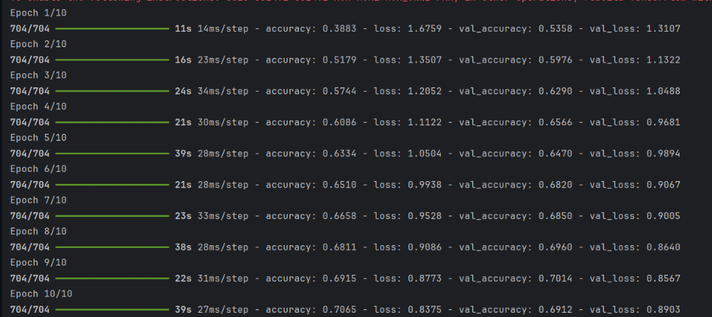
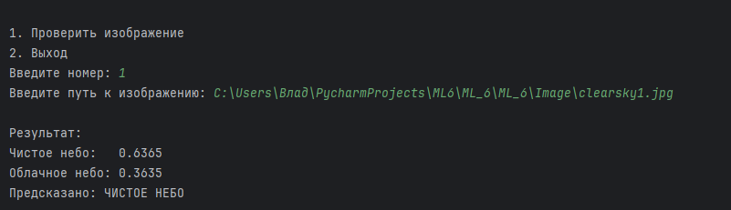

# Лабораторная работа №6. Сверточные нейронные сети.

## Общее задание

1. С использованием библиотеки **Keras** загрузить обучающую выборку, создать модель сверточной сети, обучить её на обучающей выборке и сохранить модель в файл.
2. Написать дополнительную программу, которая загружает модель из файла и предоставляет возможность загрузить изображение для классификации.

## Набор данных

В качестве набора данных использован **Sky Vision** с платформы Kaggle.  
Датасет содержит изображения облачного и безоблачного небо различного разрешения, предназначенные для бинарной классификации.

Свёрточная нейронная сеть (Convolutional Neural Network, CNN) - Специализированный тип нейронных сетей, предназначенный для обработки данных с сеточной структурой (изображений, звуковых спектрограмм, временных рядов). Основное отличие от полносвязных сетей — использование свёрточных операций для автоматического извлечения пространственных иерархических признаков.

## Свёрточный слой (Conv2D)

Применяет набор фильтров (ядер) к входному изображению для обнаружения локальных паттернов: краёв, текстур, форм. Каждый фильтр скользит по изображению, вычисляя скалярное произведение между своими весами и соответствующей областью изображения.

## Слой подвыборки (MaxPooling2D)

Уменьшает размерность карт признаков, выбирая максимальное значение в окне (обычно 2×2). Это помогает снизить вычислительную нагрузку, уменьшить количество параметров и предотвратить переобучение.

## Слой выравнивания (Flatten)

Преобразует многомерный тензор (например, 3D-выход свёрточных слоёв) в одномерный вектор, который может быть передан на полносвязные слои.

## Полносвязный слой (Dense)

Каждый нейрон соединён со всеми нейронами предыдущего слоя. Используется для финальной классификации на основе извлечённых признаков.

## Слой исключения (Dropout)

Регуляризационная техника, которая случайно “отключает” часть нейронов во время обучения, что помогает предотвратить переобучение.

## Функция потерь и оптимизатор

Функция потерь: `categorical_crossentropy` — используется для многоклассовой классификации с one-hot кодированием меток.

Оптимизатор: `adam` — адаптивный алгоритм оптимизации, сочетающий идеи RMSProp и Momentum, обеспечивающий быструю и стабильную сходимость.

## Метрика оценки

Accuracy — доля правильно классифицированных изображений относительно общего количества.

## Процесс обучения

Модель обучается в течение 20 эпох с размером пакета 2. Для валидации используется 20% обучающей выборки. После обучения модель сохраняется в формате `.h5` для последующего использования.

## Структура проекта

- `lab6.py` — основной скрипт для загрузки данных, создания, обучения и сохранения модели.
- `Lab6_num2.py` — скрипт для загрузки сохранённой модели и тестирования на отдельных изображениях.

## Обучение 

Файл: `lab6.py`

### Загрузка датасета

Датасет загружается через `kagglehub`:

```
import kagglehub
path = kagglehub.dataset_download("zeesolver/cloiud-dataset")
```

## Загрузка и предобработка изображений

Изображения загружаются, приводятся к размеру 64×64 пикселя и нормализуются:

```
def load_images(base_path, img_size=(64, 64)):

    return np.array(images), np.array(labels)

train_data, train_labels = load_images(path)
train_data = train_data.astype('float32') / 255.0
train_labels = to_categorical(train_labels, num_classes=2)
```

## Архитектура модели

```
model = Sequential()
model.add(Conv2D(32, (3, 3), activation='relu', input_shape=(64, 64, 3)))
model.add(MaxPooling2D((2, 2)))
model.add(Conv2D(64, (3, 3), activation='relu'))
model.add(MaxPooling2D((2, 2)))
model.add(Flatten())
model.add(Dense(128, activation='relu'))
model.add(Dropout(0.5))
model.add(Dense(2, activation='softmax'))

```
Свёрточный слой (Conv2D) - Слой CNN, который применяет фильтры к изображению для обнаружения паттернов (края, текстуры, формы). В вашем коде: Conv2D(32, (3, 3)) — 32 фильтра размером 3×3.

MaxPooling2D - Слой подвыборки, который уменьшает размер карты признаков, выбирая максимальное значение из области 2×2. Уменьшает вычислительную сложность и предотвращает переобучение.

Flatten -Преобразует многомерные данные (например, 3D-тензор после сверточных слоёв) в одномерный вектор для подачи на полносвязные слои.

Dense (Полносвязный слой) - Слой, где каждый нейрон соединён со всеми нейронами предыдущего слоя. Используется для классификации: Dense(128) — 128 нейронов, Dense(2) — 2 нейрона для двух классов.

Dropout - Метод регуляризации, который случайно отключает часть нейронов (50% в вашем коде) во время обучения для предотвращения переобучения.

## Обучение модели 

```
model.compile(loss='categorical_crossentropy', optimizer='adam', metrics=['accuracy'])
model.fit(train_data, train_labels, epochs=20, batch_size=2, validation_split=0.2)
```


## Сохранение модели

```
model.save('cnn_cloud_model.h5')
```

## Функция предобработки изображения

```
def preprocess_image(image_path, img_size=(64, 64)):
    img = Image.open(image_path).convert('RGB')
    img = img.resize(img_size)
    img_array = np.array(img).astype('float32') / 255.0
    img_array = np.expand_dims(img_array, axis=0)
    return img_array
```

## Тестирование



